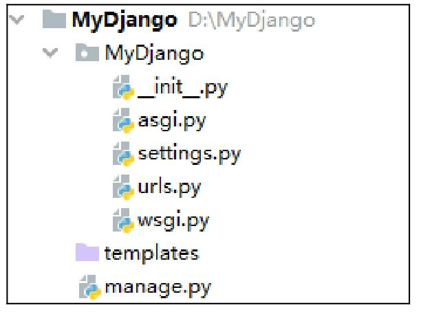

## MTV (Model Template View)

视图，是连接模型和模板的桥梁

## 创建 Django项目

django-admin startproject MyDjango

# 每个 app 代表网站的一个功能
D:\MyDjango>python manage.py startapp index

D:\MyDjango>python manage.py runserver 8001
---

- manage.py：命令行工具，内置多种方式与项目进行交互。在命令提示符窗口下，将路径切换到MyDjango项目并输入python manage.py help，可以查看该工具的指令信息。
- __init__.py：初始化文件，一般情况下无须修改。
- asgi.py：开启一个ASGI服务，ASGI是异步网关协议接口。
- settings.py：项目的配置文件，项目的所有功能都需要在该文件中进行配置，配置说明会在下一章详细讲述。
- urls.py：项目的路由设置，设置网站的具体网址内容。
- wsgi.py：全称为Python Web Server Gateway Interface，即Python服务器网关接口，是Python应用与Web服务器之间的接口，用于Django项目在服务器上的部署和上线，一般不需要修改。

- 目录结构多出了templates文件夹，该文件夹用于存放HTML模板文件
- 