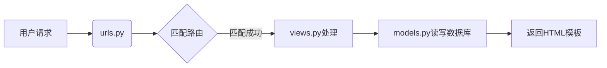

- 完整的 Django 项目结构
```Plain Text
wechat-rag-tcm/backend/django_project/
├── manage.py
├── tcm_admin/
│   ├── __init__.py
│   ├── settings.py
│   ├── urls.py
│   ├── wsgi.py
│   └── asgi.py
└── knowledge/
    ├── migrations/
    │   └── __init__.py
    ├── __init__.py
    ├── admin.py
    ├── apps.py
    ├── models.py
    ├── views.py
    └── tests.py
```


---


以下是对Django项目结构的逐层解读，用中文详细说明每个组成部分的作用：

### 一、项目根目录：django_project/
```
backend/django_project/
├── manage.py          # 项目管理入口文件
├── tcm_admin/         # 主项目配置目录（Django Project）
└── knowledge/         # 自定义应用目录（Django App）
```

### 二、核心文件详解
#### 1. manage.py（项目管理核心）
```python
#!/usr/bin/env python
""" 
Django命令行工具入口文件，功能包括：
- 启动开发服务器：python manage.py runserver
- 创建数据库迁移：python manage.py makemigrations
- 执行数据库迁移：python manage.py migrate
- 创建管理员账号：python manage.py createsuperuser
- 运行单元测试：python manage.py test
"""
```

#### 2. tcm_admin/（主项目配置目录）
```
tcm_admin/
├── __init__.py       # 空文件，声明这是一个Python包
├── settings.py       # 项目全局配置（数据库/时区/应用等）
├── urls.py           # 项目级URL路由配置
├── wsgi.py           # WSGI服务器部署接口（生产环境用）
└── asgi.py           # ASGI服务器部署接口（支持WebSocket）
```

**关键文件说明：**
- **settings.py**（核心配置文件）
  ```python
  # 数据库配置
  DATABASES = { ... }  # 定义使用的数据库类型和连接参数
  
  # 应用注册
  INSTALLED_APPS = [
      'knowledge.apps.KnowledgeConfig'  # 注册自定义应用
  ]
  
  # 国际化配置
  LANGUAGE_CODE = 'zh-hans'  # 设置中文界面
  TIME_ZONE = 'Asia/Shanghai'
  
  # 静态文件
  STATIC_URL = '/static/'  # 静态文件访问路径
  MEDIA_ROOT = BASE_DIR / 'media'  # 用户上传文件存储路径
  ```

- **urls.py**（URL路由中枢）
  ```python
  urlpatterns = [
      path('admin/', admin.site.urls),  # 管理后台路由
      path('docs/', views.DocumentListView.as_view())  # 自定义应用路由
  ]
  ```

### 三、knowledge/（自定义应用）
```
knowledge/
├── migrations/       # 数据库迁移文件目录（自动生成）
├── __init__.py       # 声明应用为Python包
├── admin.py          # 管理后台配置
├── apps.py           # 应用配置信息
├── models.py         # 数据模型定义（核心）
├── views.py          # 业务逻辑处理
└── tests.py          # 单元测试文件
```

**核心模块说明：**

#### 1. models.py（数据模型定义）
```python
class TCMDocument(models.Model):
    """ 
    定义中医知识库的数据结构：
    - title：文档标题（CharField）
    - content：文档内容（TextField）
    - doc_type：文档类型（选择字段）
    - source_file：上传的原始文件（FileField）
    - 自动记录上传时间（DateTimeField）
    """
```

#### 2. admin.py（管理后台配置）
```python
@admin.register(TCMDocument)
class TCMDocumentAdmin(admin.ModelAdmin):
    """ 
    配置管理后台界面：
    - list_display：列表页显示字段
    - list_filter：右侧过滤侧边栏
    - search_fields：顶部搜索框支持字段
    - fieldsets：编辑页字段分组布局
    """
```

#### 3. views.py（业务逻辑处理）
```python
class DocumentListView(ListView):
    """ 
    通用视图类实现文档列表功能：
    - model：关联的数据模型
    - template_name：使用的模板文件
    - paginate_by：分页数量
    - get_queryset()：数据过滤逻辑
    """
```

#### 4. apps.py（应用配置）
```python
class KnowledgeConfig(AppConfig):
    """ 
    应用元数据配置：
    - name：应用唯一标识
    - verbose_name：在管理后台显示的名称
    """
```

### 四、数据库迁移目录（migrations/）
```
migrations/
├── __init__.py
└── 0001_initial.py（示例迁移文件）
```
- **作用**：存放由`makemigrations`命令生成的数据库迁移脚本
- **工作原理**：
  1. 当修改models.py后，运行`python manage.py makemigrations`生成迁移文件
  2. 运行`python manage.py migrate`将变更应用到数据库
  3. 每个迁移文件记录数据库结构的版本变化

### 五、扩展说明
#### 1. 如何添加新功能？
- 新建`templates/`目录存放HTML模板
- 在`views.py`中添加新的视图函数/类
- 在`urls.py`中配置新的URL路由
- 在`models.py`中定义新的数据模型

#### 2. 数据流示意图


这个结构体现了Django的MTV模式：
- **Model**（models.py）：数据层
- **Template**（templates/）：表现层
- **View**（views.py）：业务逻辑层

如果需要了解某个具体模块的深度解析（如如何编写自定义模板标签），可以告诉我具体需求。
